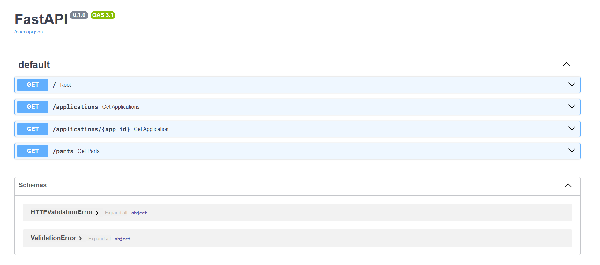
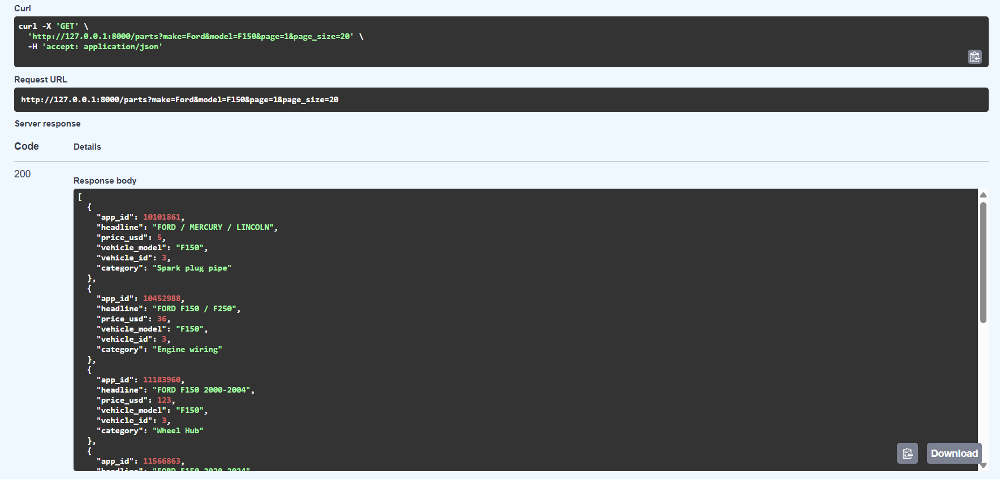

# Auto Parts Inventory API

A REST API for managing an auto parts inventory system, including parts listings, categories, sellers, and vehicle compatibility.

This project focuses on backend system design, relational database modeling, and building a clean, maintainable API layer that reflects real-world use cases.

---

## Project Overview

This project simulates a real-world inventory and parts lookup system used in service and parts departments.

The system is designed to handle structured data relationships between parts, vehicles, and categories, allowing users to query compatible parts based on vehicle attributes such as make, model, and year.

---

## Key Features

- Retrieve parts listings (applications)
- Query individual records by ID
- Vehicle-based part lookup (make, model, year)
- Part search by name or category (e.g., "brake", "headlight")
- Optional filtering by category and price range
- Pagination support for large datasets
- JWT-based authentication system
- Role-based access control (admin vs user)
- Admin-only part creation (POST /parts)
- Normalized relational database design
- Reproducible database setup pipeline
- FastAPI-based REST API
- SQLite relational database

---

## Tech Stack

- Python 3
- FastAPI
- SQLite
- SQL

---

## Project Structure

data_raw/        # Source dataset (CSV files)
docs/            # Documentation (ERD, project requirements)
fetch_data.py    # Data ingestion script
audit_data.py    # Data validation script
load_data.py     # Loads data into database
main.py          # FastAPI application
schema.sql       # Database schema
queries.sql      # SQL queries
requirements.txt # Project dependencies

---

## Database Design

The system is built using a normalized relational schema to model:

- Applications (parts listings)
- Product categories
- Sellers
- Vehicles
- Compatibility relationships between parts and vehicles

See `docs/erd.md` for the full entity relationship diagram.

---

## How to Run This Project

**1. Clone the repository**

    git clone https://github.com/MykeT-Dev/auto-parts-inventory-api.git  
    cd auto-parts-inventory-api  

**2. Create a virtual environment**

    python -m venv venv  
    venv\Scripts\activate  

**3. Install dependencies**

    pip install -r requirements.txt  

**4. Run the API**

    python -m uvicorn main:app --reload  

**5. Open in browser**

    http://127.0.0.1:8000/docs  

---

### Database Setup

To rebuild the database from scratch:

    python setup_db.py

This will:
- Create all tables from schema.sql
- Load data from CSV files
- Ensure consistent relational integrity

This design allows the database to be recreated at any time instead of relying on manual data fixes.

---

## API Usage Examples

Once the server is running, the API can be explored using the built-in Swagger UI.

---

## Authentication

The API uses JWT-based authentication.

### Get Token

POST /token

Example credentials:

- Username: admin  
- Password: admin123

- Username: user
- Password: user123

### Using the Token

1. Copy the access_token from the response  
2. Click "Authorize" in Swagger UI  
3. Enter:

Bearer YOUR_TOKEN_HERE  

### Role-Based Access

- `user` → can access GET endpoints  
- `admin` → can create new parts using POST /parts  

---

### Get all applications

GET /applications?limit=10

### Get a single application

GET /applications/{app_id}

Example:

GET /applications/10074150

### Lookup parts by vehicle

This endpoint reflects a real-world workflow where parts are searched based on vehicle compatibility rather than part number.

GET /parts?make=ford&model=mustang&year=2000

### With filters and pagination

GET /parts?make=ford&model=mustang&year=2000&page=1&page_size=20

#### Example Response

<pre><code>
  {
    &quot;app_id&quot;: 11122296,
    &quot;headline&quot;: &quot;FORD Mustang 1999-2003&quot;,
    &quot;price_usd&quot;: 83,
    &quot;vehicle_model&quot;: &quot;Mustang&quot;,
    &quot;vehicle_id&quot;: 517,
    &quot;category&quot;: &quot;Headlight&quot;
  }
</code></pre>

### Add a new part (Admin only)

POST /parts

Example request:
<pre><code>
    {
    "headline": "Brake Pad",
    "price_usd": 49.99,
    "category_id": 1,
    "seller_id": 1,
    "status_id": 1,
    "vehicle_type_id": 1,
    "in_stock": 1,
    "vehicles_id": 1,
    "bottom_year": 2010,
    "top_year": 2020
    }
</code></pre>
---

## Current Status

The core API and database pipeline are fully functional and stable.

Current focus:
- Presenting the API for portfolio demonstration
- Code cleanup and documentation

---

## Next Steps

- Introduce a frontend UI for interacting with the API
- Enhance filtering capabilities (e.g., partial text search)
- Deploy the API for public access

---

## Data Model Notes

The source dataset used in this project behaves more like marketplace listings than a normalized parts catalog.

For example:
- Vehicle information is embedded in listing headlines
- Part identity is represented through category rather than a dedicated part name field

In a production-grade system, these concerns would be separated into:
- Part identity (e.g., "Brake Pad")
- Vehicle attributes (make, model, year)
- Fitment relationships

This project adapts to the dataset while highlighting how a real-world system would be modeled differently.

---

## Author

Myke Turza