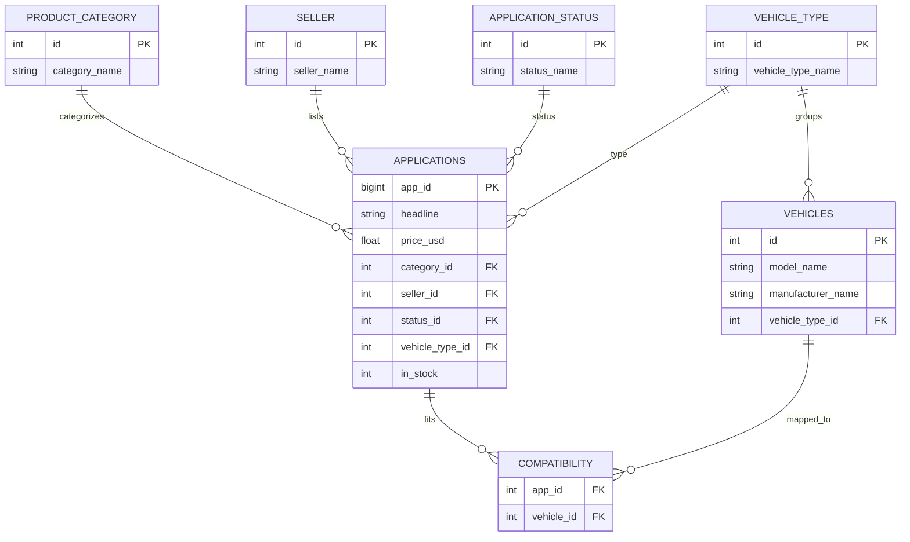

# Entity Relationship Diagram

```mermaid
erDiagram
    PRODUCT_CATEGORY ||--o{ APPLICATIONS : categorizes
    SELLER ||--o{ APPLICATIONS : lists
    APPLICATION_STATUS ||--o{ APPLICATIONS : status
    VEHICLE_TYPE ||--o{ APPLICATIONS : type

    VEHICLE_TYPE ||--o{ VEHICLES : groups

    APPLICATIONS ||--o{ COMPATIBILITY : fits
    VEHICLES ||--o{ COMPATIBILITY : mapped_to

    APPLICATIONS {
        bigint app_id PK
        string headline
        float price_usd
        int category_id FK
        int seller_id FK
        int status_id FK
        int vehicle_type_id FK
        int in_stock
    }

    PRODUCT_CATEGORY {
        int id PK
        string category_name
    }

    SELLER {
        int id PK
        string seller_name
    }

    APPLICATION_STATUS {
        int id PK
        string status_name
    }

    VEHICLE_TYPE {
        int id PK
        string vehicle_type_name
    }

    VEHICLES {
        int id PK
        string model_name
        string manufacturer_name
        int vehicle_type_id FK
    }

    COMPATIBILITY {
        int app_id FK
        int vehicle_id FK
    }
```